# Apex_PerfAtlas

Performance evidence, hardware feasibility and deployment economics for the Apex ecosystem and independent domain projects.

The first release implements an offline evidence validator, metric comparison eligibility, a sourced public benchmark-family catalogue, optimization hypotheses and cash-economics calculations. The objective is to make performance improvements reproducible and commercially assessable. It does not claim benchmark records or a combined score across unrelated workloads.

## Run it

```bash
python -m venv .venv
source .venv/bin/activate
pip install -e '.[test]'
python -m pytest -q
apex-atlas validate examples/design-only.json
apex-atlas catalog
apex-atlas suggest STAC-T0
apex-atlas economics examples/cost-scenario.json
apex-atlas compare baseline/run.json candidate/run.json
```

An ineligible comparison exits with status 2 and lists the reasons. A design-only record can pass structural checks while remaining explicitly unexecuted; it cannot enter measured comparisons. Local validation checks hashes, consistency and raw latency summaries. It does not authenticate a submitter's claim of independent validation.

## Evidence model

[Run contract](contracts/run.schema.json) separates implementation, environment, measurement and validation. Each measured run retains source/build/config/workload identities, chronological samples, traffic accounting, metric populations and limitations. Hashes establish artifact integrity, not authorship. A receipt requires separate authentication and custody for stronger claims.

Accounting in v0 is `offered = accepted + rejected + dropped` and `accepted = completed + unresolved`. Wrong and duplicate outputs are violations. The initial comparison profile additionally requires zero rejection, loss and unresolved work. Other benchmark profiles must define their own accounting and acceptable traffic policy before support is added.

Quantiles use nearest-rank order statistics. Observed maxima are finite-run observations. Warmup and sampling policy are compared; no automatic tail trimming or statistical-significance claim is made. External-instrument records require real backend, calibration, clock and uncertainty artifacts. Copy, simulation and hardware measurements retain separate identities.

## Public STAC coverage

The catalogue covers STAC-N1, T0, T1, M1, M2, N2, TS, A2, A3, M3, ML and AI at the public family level. It provides hypotheses, access requirements and falsification criteria. Exact premium specification versions and metric catalogues require authorized access. No STAC harness, premium specification or private dataset is redistributed. STAC names remain their owners' trademarks. [Public benchmark catalogue](https://stacresearch.com/benchmarks/).

STAC-T0 actionable latency starts at the last inbound bit required for the decision and ends at the first simulated outbound-order bit. Exegy/AMD's June 2024 minimum of 13.9 ns is a historical, boundary-specific reference; it is not an Apex measurement or an established current frontier. [Report announcement](https://docs.stacresearch.com/news/AMD240422).

## Hardware, software and process limits

[Catalogue](catalog/catalog.json) records exact known board identifiers, candidate roles and remaining access gates. Corundum documents its MAC-clock direct application interface as its lowest-latency connection; integrating an application still requires timing closure and external measurement. [Interface documentation](https://docs.corundum.io/en/latest/modules/mqnic_app_block.html).

Cisco K3P-S uses XCKU3P-2, two SFP28 ports and published 4 ns timestamp resolution. Resolution is not calibrated uncertainty and cannot by itself substantiate a sub-nanosecond improvement. [Cisco datasheet](https://www.cisco.com/c/en/us/products/collateral/interfaces-modules/nexus-smartnic/datasheet-c78-743827.html).

For eFPGA and hybrid/custom ASICs, require a qualified macro/PDK, tools, corners, physical implementation, die/package crossing models, yield and test assumptions. DUV/EUV exposure belongs in layer-specific process metadata, not a trading-latency prediction. [Achronix Speedcore](https://www.achronix.com/product/speedcore), [ASML EUV](https://www.asml.com/en/products/euv-lithography-systems).

## Deployment economics

Unknown inputs remain null. Every real cost input needs date, scope, currency, source/quote, validity, quantity tier and tax treatment. The example contains explicitly fictional assumptions. The implemented calculator reports constant-cashflow NPV, expected outage cost and undiscounted payback; it does not infer revenue from latency.

Colocation scenarios must itemize cabinet, power, handoffs, cross-connects, logical ports, entitlements, setup, operations, spares, support and taxes. A physical proximity or connectivity benefit does not establish queue priority or profit. [Nasdaq tariffs](https://www.nasdaqtrader.com/trader.aspx?id=pricelisttrading2), [CME colocation](https://www.cmegroup.com/solutions/co-location.html), [ICE colocation](https://www.ice.com/fixed-income-data-services/access-and-delivery/connectivity-and-feeds/icecolocation).

## Apex and the broader portfolio

[Apex_ULL](https://github.com/AAH20/Apex_ULL) emits native software measurements; [Apex_Tick](https://github.com/AAH20/Apex_Tick) develops a bounded FPGA trading core. [Portfolio adapter proposals](catalog/portfolio-adapters.json) retain finance, AI inference, graph optimization, infrastructure and governance as independent domains. Candidate relationships do not imply shipped adapters or a shared runtime. The evidence schema is Apache-2.0; consuming data through this contract does not relicense Apex_ULL, which remains AGPL-3.0-or-later.

## Architecture and release boundary

[Mermaid source](docs/atlas.mmd) uses explicit dark cards and white labels. Physical hardware runners, authenticated independent receipts, a qualified ASIC flow, licensed STAC execution and live deployment are future integrations. See [partner evaluation](docs/partner-evaluation.md) for the evidence required to advance those claims.

Copyright 2026 Ahmed Hassan. Apache-2.0. Integration inquiries: aah@a2zsoc.com.



Editable [Mermaid source](docs/atlas.mmd). Node labels distinguish implemented components, trusted inputs, and planned adapters. The architecture includes future gates; it is not a claim that the full pipeline has shipped.
